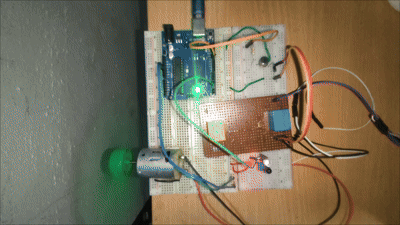
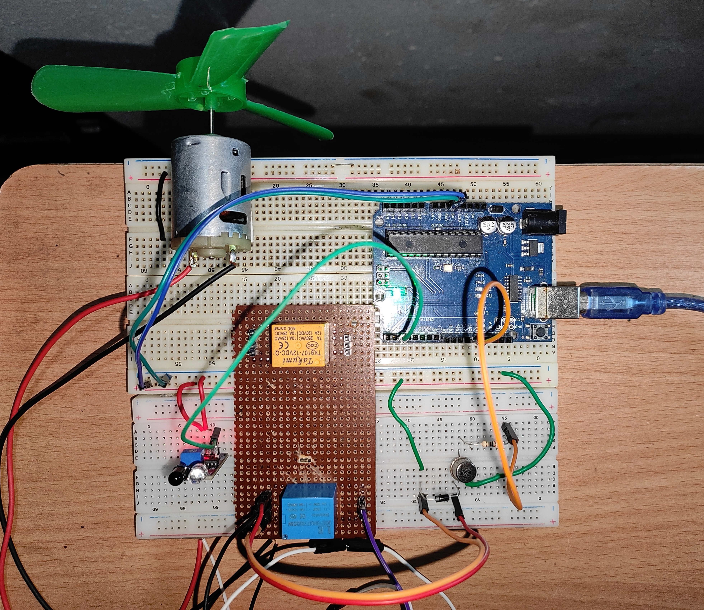
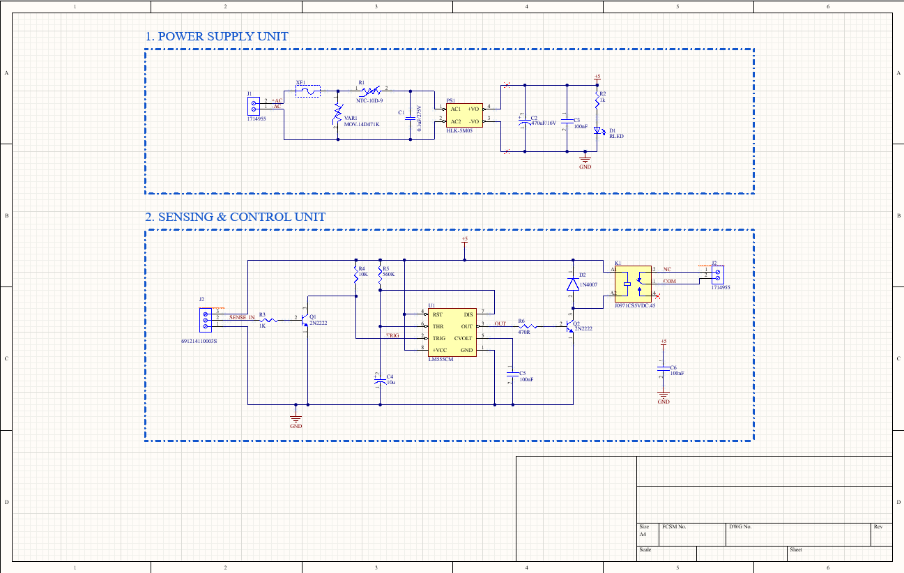
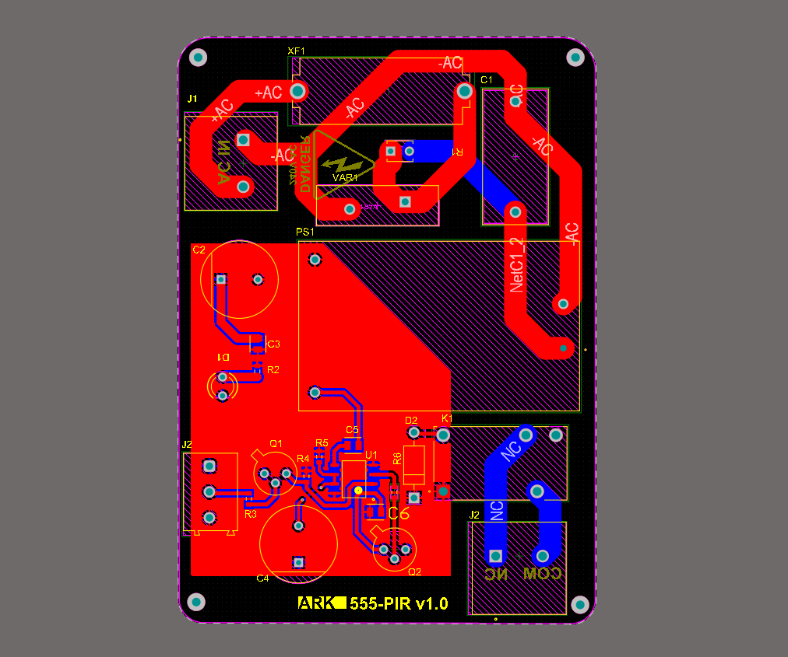
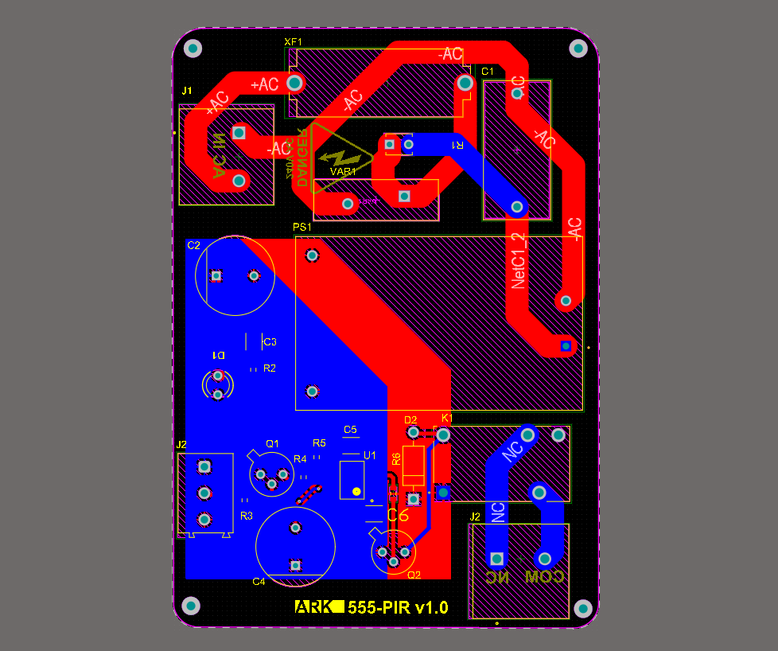
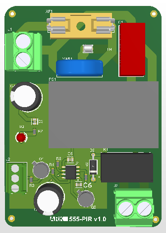
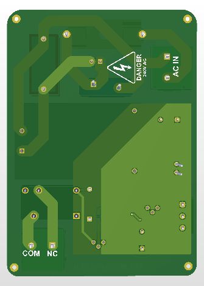

# proxi-machine-cutoff-circuitk (PIR / 555 Timer)

An emergency safety interlock module designed to instantly shut down moving industrial machinery, high-voltage AC equipment, or heavy DC devices when human presence or motion is detected near dangerous moving parts.

This repository covers the complete hardware development path—from a low-voltage bare-metal C microcontroller prototype controlling a 12V DC motor to a production-ready dedicated 555 timer PCB powered directly by AC mains.

---

## Working Demo & Media

### **Hardware Prototype in Action**

> 📹 **[Watch Full High-Resolution Demonstration Video](docs/images/prototype/prototype.mp4)**

### **Benchtop Prototype Setup**
<table>
  <tr>
    <td align="center"></td>
  </tr>
</table>

---

## Target Application & Industrial Use Case

In workshop and industrial automation environments, heavy machinery (drills, lathes, conveyor belts, or high-voltage AC cutters) presents severe injury risks to operators. 

### **How it Works:**
1. **Normal Operation:** Machinery connected through the relay operates continuously while no human hands or body parts are in the hazard zone.
2. **Hazard Detection:** The moment a worker's hand or body enters the sensor's field of view near moving parts, the circuit **instantly cuts off power** to the high-voltage AC or DC machine to prevent accidents.
3. **Safety Hold:** Power remains disabled until the operator clears the hazardous zone and the safety hold-off timer expires.

---

## Prototyping & Development Progression

### **Phase 1: Prototyping (12V DC Setup)**
* **Controller:** Arduino Uno running **bare-metal Embedded C**.
* **Sensor:** Active IR sensor module.
* **Load:** **12V DC motor** powered by an external 12V supply, switched via a 5V relay module (NC contact).

### **Phase 2: Hardware Simplification (From MCU to 555 Timer PCB)**

* **Why the Arduino was replaced:** A microcontroller introduces unnecessary hardware costs, software compilation risk, potential firmware lockups/crashes, and boot-up delays.
* **The 555 Timer Solution:** Replaced the MCU with a simple, robust **LM555 timer IC in monostable mode**. It operates instantly on power-up, less expensive, requires zero firmware, and provides robust analog reliability.

---

### **Why PIR was Selected for the Final PCB:**
1. **Human Body Heat Discrimination:** Standard IR proximity sensors trigger when wood, metal chips, or tools break the beam. PIR modules specifically detect human body heat movement, ensuring the cut-off triggers reliably when an operator's hand enters the area.
2. **Wide Protection Zone:** A PIR sensor creates a broad 3D safety envelope over the entire dangerous mechanical region rather than a tiny single-point IR beam.
3. **Immunity to Industrial Noise:** PIR sensors are passive detectors and are not blinded by bright factory lights, flying debris, or reflective machine surfaces.

---

## ⚡ Safety Warning

> **DANGER: HIGH VOLTAGE MAINS POWER (110V–240V AC)**  
> The final PCB module connects directly to mains power. Improper handling, touching exposed tracks while powered, or short circuits can cause electrocution, fire, or severe injury.  
> * **Never service or touch the board while plugged into AC mains.**
> * Always enclose the PCB in an insulated, fire-retardant box.

---

## 📐 Circuit Analysis & Detailed Calculations

### 1. Instant Cut-Off Response Delay

When an operator's hand enters the hazardous zone, the time required to break power to the load is determined by the analog component delays:

* **Transistor Q1 Turn-ON Time:** < 1 µs (Saturates when SENSE_IN goes HIGH, pulling Pin 2 TRIG below 1/3 VCC).
* **555 Timer Propagation Delay:** ~100 ns to 500 ns (Output Pin 3 transitions to HIGH).
* **Relay Mechanical Contact Opening Time:** ~5 ms to 10 ms.
* **Total Response Time:** **~5 ms to 10 ms** (Virtually instantaneous cut-off).

---

### 2. Monostable Safety Hold-Off Time (T)

The 555 timer (U1) is configured in monostable mode. The safety lockout period T is governed by resistor R5 and capacitor C4:

$$T = 1.1 \times R_5 \times C_4$$

Given schematic component values:
* R5 = 560 kΩ = 560,000 Ω
* C4 = 10 µF = 0.00001 F

$$T = 1.1 \times 560,000 \times 0.00001 = 6.16\text{ seconds}$$

* **Active Motion State:** As long as the operator's hand remains in the zone, Q1 holds Pin 2 (TRIG) LOW. The trigger input overrides threshold Pin 6, keeping the relay energized and load disconnected indefinitely.
* **Restoration State:** When motion clears, power remains locked out for **6.16 seconds** before automatically reconnecting the load.

---

### 3. Transistor Drive Calculations

#### Transistor Q1 (Trigger Inverter Stage):
* **Input Voltage (VPIR):** 3.3 V
* **Base Current (IB1):**

$$I_{B1} = \frac{V_{PIR} - V_{BE}}{R_3} = \frac{3.3\text{V} - 0.7\text{V}}{1000\,\Omega} = 2.6\text{ mA}$$

*(2.6 mA fully saturates Q1, pulling Pin 2 to 0V instantly).*

#### Transistor Q2 (Relay Driver Stage):
* **Output Voltage (VOH at 5V supply):** ~4.0 V
* **Base Current (IB2):**

$$I_{B2} = \frac{V_{OH} - V_{BE}}{R_6} = \frac{4.0\text{V} - 0.7\text{V}}{470\,\Omega} \approx 7.02\text{ mA}$$

* **Calculated Forced Gain (βsat):**

$$\beta = \frac{I_{Coil}}{I_{B2}} = \frac{80\text{ mA}}{7.02\text{ mA}} \approx 11.4$$

*(Since 11.4 << 100, Q2 operates reliably in deep saturation).*

---

## Hardware Design & PCB Render

## Schematic

<table>
  <tr>
    <td align="center"></td>
  </tr>
</table>

---

## PCB Layout

<table>
  <tr>
    <td align="center"></td>
    <td align="center"></td>
  </tr>
</table>

## 3D PCB View

<table>
  <tr>
    <td align="center"></td>
    <td align="center"></td>
  </tr>
</table>

---

## Complete Bill of Materials (BOM)

| Designator | Component / Part Number | Description | Footprint / Package | Qty |
| :--- | :--- | :--- | :--- | :---: |
| **PS1** | HLK-5M05 | AC-DC 220V to 5V 5W Isolated Power Supply | Through-Hole Module | 1 |
| **U1** | LM555CM / NE555 | General Purpose Single Timer IC | SOIC-8 | 1 |
| **Q1, Q2** | 2N2222 | NPN Bipolar Transistor | SOT-23 / TO-92 | 2 |
| **K1** | J0971CS5VDC.45 | SPDT Relay 5VDC Coil (10A 250VAC) | Through-Hole Relay | 1 |
| **D2** | 1N4007 | Flyback Protection Diode (1000V 1A) | DO-41 / SMA | 1 |
| **VAR1** | MOV-14D471K | Varistor 470V 4.5kA | Radial Disc 14mm | 1 |
| **R1** | NTC-10D-9 | NTC Thermistor (Inrush Limiter) | Radial Lead | 1 |
| **C1** | 0.1µF / 275V | Class-X2 Safety Suppression Cap | Radial Box | 1 |
| **C2** | 470µF / 16V | Aluminum Electrolytic Capacitor | Radial | 1 |
| **C3, C5** | 100nF | Ceramic Decoupling Capacitor | 0805 | 2 |
| **C4** | 10µF / 25V | Electrolytic Timing Capacitor | Radial | 1 |
| **R3, R2** | 1kΩ | Resistor (0.25W) | 0805 | 2 |
| **R4** | 10kΩ | Resistor (0.25W) | 0805 | 1 |
| **R5** | 560kΩ | Resistor (0.25W) | 0805 | 1 |
| **R6** | 470Ω | Resistor (0.25W) | 0805 | 1 |
| **J1** | 1714955 | 2-Pin Screw Terminal (AC Mains Input) | Pitch 6.35mm | 1 |
| **J2** | 691214110003S | 3-Pin Screw Terminal (PIR Sensor Input) | Pitch 3.81mm | 1 |
| **J3** | 691214110003S | 3-Pin Screw Terminal (Load Relay Output) | Pitch 5.08mm | 1 |

---

## PCB Safety & Layout Features

* **Strict Isolation Creepage:** High-voltage AC copper tracks maintain >6 mm clearance from the low-voltage DC SELV ground plane.
* **Top Copper Restraint:** High-voltage regions feature complete ground pour exclusion to prevent high-voltage arcing.
* **45-Degree Chamfering:** All high-voltage AC tracks route at 45° angles to minimize high-voltage point stress.
* **Silkscreen ISO Markings:** The bottom layer features explicit `DANGER 240V AC` warning symbols along with terminal descriptors (`AC IN`, `NO`, `COM`).

---

## License

This project is licensed under the [MIT License](LICENSE).
